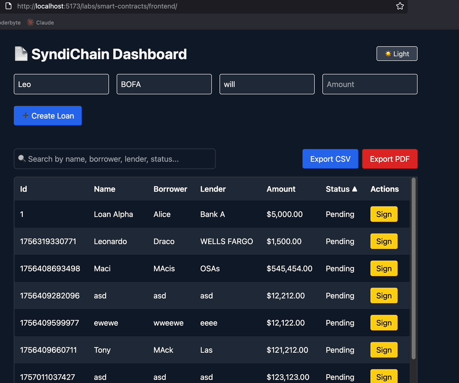

## 🛠️ Tech Stack

### Backend
- [NestJS](https://nestjs.com/) (TypeScript)
- Express.js (platform adapter)
- class-validator, class-transformer
- RxJS
- TypeScript

### Frontend
- [React](https://react.dev/) + [Vite](https://vitejs.dev/)
- TypeScript (optional, depending on your setup)
- TailwindCSS (if configured)

### Dev Tools
- [Concurrently](https://www.npmjs.com/package/concurrently) to run frontend & backend together
- Node.js (>= 18.x recommended)

## 🚀 Getting Started

### 1. Clone repo

```bash
git clone https://github.com/leoreyesdev/dev-labs.git
cd dev-labs
git checkout contracts-api
```
<h2 align="center">🎥 Demo</h2>

<p align="center">
  
</p>

